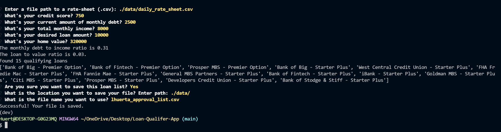

# The Loan Qualifier App

This is a command line application for qualifying new loan clients.

---

## Technologies

This application leverages python with the following packages:
* [fire](https://github.com/google/python-fire) - For the command line interface, help page, and entry-point.

* [questionary](https://github.com/tmbo/questionary) - For interactive user prompts and dialogs


---

## Installation Guide

Before running the application first install the following dependencies.

```python
  pip install fire
  pip install questionary
```
---

## Usage

The image below shows step by step each question in this app an sample responses:


---

## Contributors

Letty Huerta
Rice FinTech Bootcamp

---

## License

MIT
